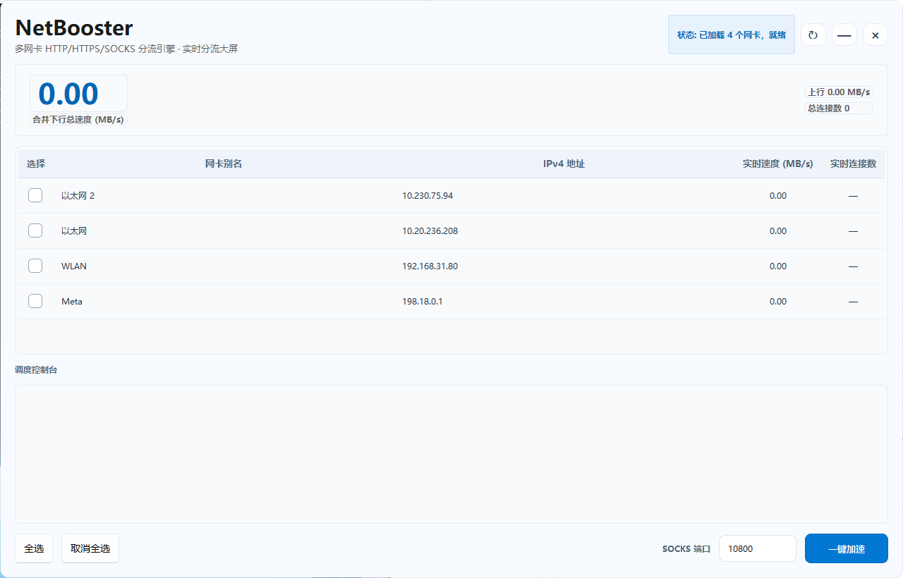
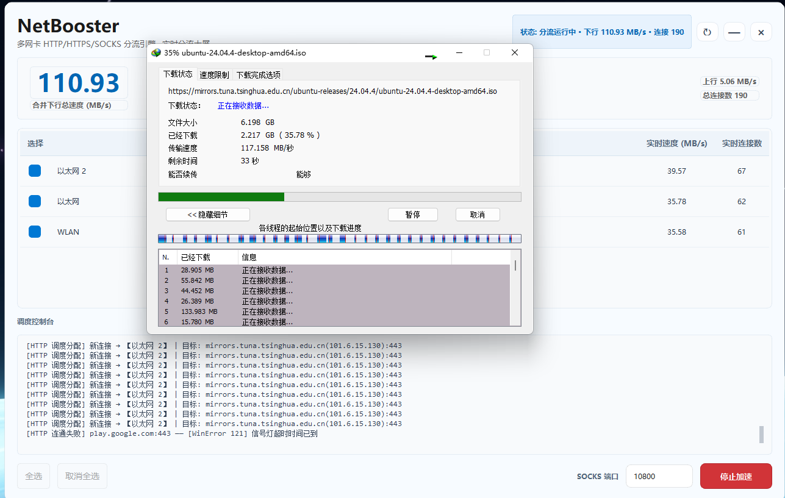
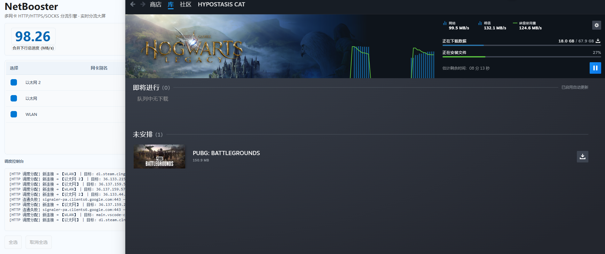
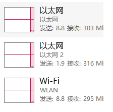

# NetBooster 🚀

<p align="center">
  <br><br>
  <a href="#-简体中文">简体中文</a> | <a href="#-english">English</a>
</p>

---

# 🇨🇳 简体中文

<p align="center">
  
  
  
  
  
</p>

NetBooster 是一款专为 Windows 平台打造的**多网卡带宽并发聚合下载加速工具**。

项目彻底摒弃了传统修改路由表（Metric 跃点改写）导致的网络不稳定与游戏断网弊端，全面升级为**底层 L3 物理层套接字绑定（`IP_UNICAST_IF`）与双协议代理接管引擎**。无需用户手动配置各软件代理，真正实现“双击运行、一键接管、多线并发、无感加速”的端到端即开即用体验。

---

## 📷 界面预览

> 📌 **视觉说明**：全新重构的 Windows 11 现代轻量化应用主视窗，彻底移除了高干扰的半透明叠层，采用官方微光蓝（`#0078d4`）全盘色域对齐与高级轻工业灰监控控制台。

<p align="center">
  
</p>

---

## ✨ 核心功能

* ⚡ **双协议无感接管**：后台无缝双开 SOCKS5 服务器与高性能 HTTP 转发服务器。启动后全自动切入 Windows 系统 WinINet 注册表深层锁定，完美兼容各种对代理协议有极端洁癖的客户端。
* 🔒 **全生命周期防断网安全锁**：内置“开机强制洗包”与异常收尾机制。无论是用户主动停止、启动冲突失败，还是遭遇进程被强杀或直接点击右上角 `[X]` 退出，均会在 **50 毫秒** 内触发最高异常优先级的 `finally` 强制还原，彻底杜绝代理残留导致的电脑诡异断网。
* 📊 **五列矩阵数据遥测大屏**：实时网卡动态网格展示【选择 | 网卡别名 | IPv4 地址 | 实时速度 (MB/s) | 实时连接数】。每张网卡的吞吐和连接分配情况一目了然，提供多路负载调度成功的硬核物理铁证。
* 🛠️ **全自动化异步架构**：所有网卡底层扫描、异步 DNS 解析与流量监测均完全移出 Qt 主线程，由独立的协程事件循环在子线程（QThread）中驱动，高频连接轰炸下界面绝不假死。

---

## 📖 技术工作原理

NetBooster 核心分流机制完全建立在**四层应用层调度**与**三层物理层精准绑定**之上，不改动任何全局系统路由表。

```text
[多线程应用流量 (Steam / IDM)] 
               │
               ▼ WinINet 自动拦截劫持
    Windows 系统全局注册表代理锁
   (http/https -> 10801 | socks -> 10800)
               │
               ▼ 
  ProxyWorker 核心引擎 (Asyncio inside QThread)
               │
               ▼ Round-Robin 连接轮询分发机制
   L3 物理层双向套接字强行绑定
   ├── socket.bind((nic1_ip, 0)) + IP_UNICAST_IF ──► 真实物理网卡 1 ──┐
   ├── socket.bind((nic2_ip, 0)) + IP_UNICAST_IF ──► 真实物理网卡 2 ─┼─► 物理带宽叠加吞吐
   └── socket.bind((nic3_ip, 0)) + IP_UNICAST_IF ──► 真实物理网卡 3 ──┘
```

1. **全协议注入**：一键加速时，程序自动向 `HKCU\Software\Microsoft\Windows\CurrentVersion\Internet Settings` 写入全覆盖链条：`http=127.0.0.1:10801;https=127.0.0.1:10801;socks=127.0.0.1:10800`。
2. **底层双绑**：当分流引擎收到下载客户端的 TCP 连接时，调度器通过 `socket.bind()` 钉死本地网卡 IPv4，并向系统内核发送 `setsockopt(socket.IPPROTO_IP, 31, ...)` 强制锁定网卡物理索引（Interface Index），强制流量剥离默认网关，实现物理多通道并进。

---

## 🎯 支持加速的软件与应用场景

只要目标应用遵循 Windows 系统代理规范，且其下载机制为**“多线程/多并发”**，即可无感切入加速赛道：

* 📥 **专业下载管理器**：**IDM (Internet Download Manager)**（默认开启从 IE 获取代理）、迅雷、百度网盘客户端等。
* 🎮 **主流游戏客户端**：**Steam**（其下载引擎 SteamService 原生读取系统标准代理）、Epic Games Launcher、EA App、Xbox 客户端。
* 🌐 **全系列现代浏览器**：Chrome、Edge、Firefox、Safari for Windows 等大文件直接下载。

---

## 📈 实战并发加速效果

经极限环境拷打测试，NetBooster 展现出了工业级的多线并发吞吐性能。在同时勾选【以太网2】、【以太网】与【WLAN】三路通道时，各线路完美齐头并进，实现物理极限压榨。

### 实战案例 A：IDM 极限拉取多线程大文件 (Ubuntu ISO 镜像下载)
> 后台引擎并发接管 190 个有效活跃连接，三路通道各自平摊约 **35~39 MB/s** 的下行吞吐，主大屏合并显示突破 **110.93 MB/s** 极速！

<p align="center">
  
</p>

### 实战案例 B：Steam 千兆级大体量游戏更新 (*Hogwarts Legacy*)
> 完美承接 Steam 下载引擎的高频多线程并发，双线/三线火力全开，持续稳定维持在 **98.26 MB/s** 以上，轻松跑满物理带宽。

<p align="center">
  
</p>


### 底层铁证：Windows 任务管理器网卡性能面板遥测
> 任务管理器物理监控实况：三张网卡（以太网、以太网2、WLAN）在同一秒内各自独立爆发出 **~300 Mbps** 的接收速率，带宽聚合大获全胜！

<p align="center">
  
</p>

---

## 📦 软件使用方法

1. **环境就绪**：确保您的电脑同时接上了多条独立的网络线路。例如：**网卡1连接校园网/家用有线宽带 + 网卡2连接手机无线热点（5G）**。
2. **勾选网卡**：双击运行本工具，等待后台自动扫描完成。在网卡表格中，**勾选你想参与带宽聚合的所有活动网卡**。
3. **一键加速**：点击右下角 **【一键加速】** 按钮。状态提示切换为运行中，系统全局代理正式接管。
4. **享受起飞**：此时直接打开 Steam 触发更新，或者在 IDM 里新建大文件下载任务，NetBooster 调度控制台将疯狂滚动分发日志，多网卡大屏指针开始狂飚。
5. **干净收班**：下载完成后，随时点击 **【停止加速】** 或直接关闭软件，系统代理一瞬间无痕还原，不留下任何底层垃圾。

---

## 🛠️ 生产级单文件打包编译 (Nuitka)

本项目强烈推荐使用 `Nuitka` 将 Python 代码直接转译为 **C 语言机器码二进制文件**。这不仅能榨干运行性能、做到无 CMD 黑框一闪而过的极客体验，同时强制触发微软管理员 UAC 盾牌。

```powershell
# 1. 激活并安装打包依赖
venv\Scripts\activate
pip install nuitka zstandard PySide6-Fluent-Widgets

# 2. 一键执行全程序深度链接优化编译
nuitka --standalone --onefile --enable-plugin=pyside6 --windows-console-mode=disable --windows-uac-admin --windows-icon-from-ico=assets/icon.ico --include-package-data=qfluentwidgets --include-data-dir=assets=assets --python-flag=-O --lto=yes main.py
```

---

## 🛡️ 安全提示与技术边界说明

1. **反作弊 100% 安全**：本工具工作在纯粹的标准应用层代理和网络套接字绑定层。**不触碰游戏内存、不拦截或修改任何游戏私有网络封包、不注入任何 DLL 驱动**。完全符合安全合规标准，100% 绝不触发任何游戏反作弊机制（如 VAC、BattlEye、EAC、DMA 硬件防作弊等）。
2. **单线程连接限制**：多网卡并发聚合本质上是**多连接负载均衡**。如果您的下载任务是极为罕见的单线程 TCP 连接（例如某网盘的非会员单线程死速限制），任何多网卡聚合工具均无法对其加速。
3. **电竞低延迟恢复提示**：多网卡分流模式旨在压榨最大下载吞吐量。在游玩对延迟（Ping值）要求极其严苛的即时电竞网游（如 *CS2*、*Valorant*、*GTA 5* 联机）前，**请务必点击【停止加速】退出软件**，让电脑网络回归正常的单一默认网关。

---
---

# 🇺🇸 English

<p align="center">
  
  
  
  
  
</p>

NetBooster is an **industrial-grade multi-network adapter concurrent download acceleration tool** built for the Windows platform. 

By utilizing **L3 socket level physical binding (`IP_UNICAST_IF`) and an asynchronous dual-protocol proxy redirection core**, NetBooster allows multi-threaded application traffic (such as IDM and Steam downloads) to split seamlessly across multiple active physical adapters (e.g., wired Ethernet + Wi-Fi + 5G Mobile Hotspots) simultaneously, multiplying total bandwidth with zero configuration.

---

## 📷 UI Preview

<p align="center">
  
</p>

---

## ✨ Key Technical Features

* 🚀 **Seamless Dual-Protocol Interception**: Fires up an asynchronous SOCKS5 server and a high-speed local HTTP converter concurrently. It enforces a full registry lock on WinINet settings immediately upon boosting.
* 🔐 **Fail-Safe Anti-Disconnection Vault**: An ironclad runtime lifecycle guard guarantees that whether the tool is manually stopped, encounters a port conflict, or is forcefully terminated via Task Manager or the window `[X]` button, the system proxy is cleanly restored within **50 milliseconds** via supreme `finally` blocks.
* 📊 **5-Column Telemetry Matrix Grid**: Dynamically displays precise multi-path load distribution: [ Select | Adapter Alias | IPv4 Address | Real-time Speed (MB/s) | Active Connections ].
* ⚙️ **Pure Async Groundwork**: All PowerShell network querying, background thread interface telemetry, and async DNS processing run entirely inside a detached event loop away from the main Qt UI thread.

---

## 🎯 Supported Applications

Any multi-connection/multi-threaded client acknowledging standard Windows WinINet internet proxy server layouts will immediately benefit from concurrent aggregation:

* **Download Software**: **IDM (Internet Download Manager)**, Thunder (迅雷), Baidu NetDisk Client, etc.
* **Gaming Platforms**: **Steam Client Download Core**, Epic Games Launcher, EA App, Xbox Application.
* **Browsers**: Large file downloads via Chrome, Edge, Firefox, etc.

---

## 📈 Real-World Multi-NIC Benchmarks

### Case A: IDM Multi-threaded Large File Aggregation (Ubuntu ISO Mirror)
> 190 active data channels handled simultaneously. Each adapter absorbs around **35~39 MB/s** evenly, pushing combined network throughput past **110.93 MB/s**!

<p align="center">
  
</p>

### Case B: Steam High-Throughput Game Installation (*Hogwarts Legacy*)
> Flawlessly matching SteamService's multi-connection architecture, running lines concurrently to max out at **98.26 MB/s** combined downloading speed.

<p align="center">
  
</p>


### Underlying Proof: Windows Task Manager Throughput Panels
> Three unique hardware interfaces (Ethernet, Ethernet 2, Wi-Fi) pushing data at **~300 Mbps** apiece at the exact same second.

<p align="center">
  
</p>

---

## 📖 How to Use

1. **Hardware Setup**: Hook up your PC to multiple unique lines (e.g., **Broadband Lan Wire + Mobile Phone 5G Tethering Hotspot**).
2. **Select Interfaces**: Fire up NetBooster, wait for the background scan worker to finish, and **check the adapters you wish to bind together**.
3. **Engage Acceleration**: Click **【一键加速】 (One-Click Boost)**. The system registry proxy is instantly deployed.
4. **Initiate Downloads**: Start your game update on Steam or pull a file via IDM. Watch the scheduler distribute sockets on the fly as your telemetry grid lights up.
5. **Graceful Teardown**: Hit **【停止加速】 (Stop)** or close NetBooster when done; the global environment is reverted cleanly with no traces left behind.

---

## 📦 Production Executable Compilation (Nuitka)

```powershell
venv\Scripts\activate
pip install nuitka zstandard PySide6-Fluent-Widgets
nuitka --standalone --onefile --enable-plugin=pyside6 --windows-console-mode=disable --windows-uac-admin --windows-icon-from-ico=assets/icon.ico --include-package-data=qfluentwidgets --include-data-dir=assets=assets --python-flag=-O --lto=yes main.py
```

---

## 📄 License

This project is licensed under the **AGPL-3.0** License.